<div align="center">
  
# 👨‍💻 Ivan Borisov


<p align="center">
  <a href="https://techcatalyst.xyz"></a>
  <a href="https://linkedin.com/in/borisov-ivan"></a>
  <a href="https://t.me/techcatalyst_vc"></a>
  <a href="mailto:2622610@gmail.com"></a>
</p>


</div>

## 🌟 About Me

I'm a **hands-on CTO** who still writes code while leading teams of 20+ engineers. Currently building the future of Web3 at [TechCatalyst Ventures](https://techcatalyst.xyz), where we're pioneering **AI-native blockchain development**.

```python
class IvanBorisov:
    def __init__(self):
        self.role = "Chief Technology Officer"
        self.company = "TechCatalyst Ventures"
        self.location = "Limassol, Cyprus 🇨🇾"
        self.experience_years = 12
        self.code_daily = True
        
    def current_focus(self):
        return [
            "🤖 AI-Powered Smart Contract Security",
            "⚡ High-Performance DeFi Infrastructure", 
            "🌉 Cross-Chain Interoperability",
            "🚀 Scaling Web3 to 1M+ TPS"
        ]
    
    def achievements(self):
        return {
            "tvl_secured": "$2B+",
            "daily_volume": "$200M+",
            "engineers_led": "100+",
            "audits_performed": "50+",
            "zero_incidents": True
        }
```

<div align="center">
  
## 💼 Professional Journey


</div>

| 🏢 Company | 💡 Role | 🎯 Key Achievement | 📅 Period |
|------------|---------|-------------------|-----------|
| **TechCatalyst Ventures** | Founder & Managing Partner | Raised $5M, launched 3 AI-Web3 products | 2024-Present |
| **BTC-Alpha** | CTO / AI Innovation Leader | Scaled to $50M daily volume, 99.99% uptime | 2023-2025 |
| **Locus Finance** | CTO / DeFi Architect | Built platform from 0 to $20M TVL | 2023-2025 |
| **3commas.io** | Blockchain Architect | Handled $1B+ monthly volume | 2021-2023 |
| **MixBytes** | Head of Audits | Secured $2B+ in DeFi protocols | 2020-2021 |

<div align="center">
  
## 🛠️ Tech Arsenal


### 🔥 Expertise Matrix

</div>

<table align="center">
<tr>
<td align="center" width="33%">

### 🔗 Blockchain


</td>
<td align="center" width="33%">

### 🤖 AI/ML


</td>
<td align="center" width="33%">

### ⚙️ Systems


</td>
</tr>
</table>

<div align="center">

## 📊 Impact Metrics

```mermaid
graph LR
    A[12+ Years Experience] --> B[$2B+ TVL Secured]
    B --> C[100K+ TPS Systems]
    C --> D[50+ DeFi Audits]
    D --> E[Zero Security Incidents]
    E --> F[100+ Engineers Managed]
    
    style A fill:#FF6B6B,stroke:#fff,stroke-width:2px
    style B fill:#4ECDC4,stroke:#fff,stroke-width:2px
    style C fill:#45B7D1,stroke:#fff,stroke-width:2px
    style D fill:#96CEB4,stroke:#fff,stroke-width:2px
    style E fill:#FECA57,stroke:#fff,stroke-width:2px
    style F fill:#9B59B6,stroke:#fff,stroke-width:2px
```


</div>



<div align="center">

## 🚀 Current Initiatives

</div>

<table>
<tr>
<td width="50%">

### 🧠 AI x Web3 Research
Building next-gen infrastructure combining LLMs with blockchain:
- **Smart Contract Co-Pilot**: AI assistant for Solidity developers
- **Automated Security Scanner**: GPT-4 powered vulnerability detection
- **DeFi Strategy Optimizer**: ML-driven yield optimization

</td>
<td width="50%">

### 🏗️ Open Source Projects
<a href="https://github.com/PillarDevelopment/defi-protocol-suite">
  
</a>
<a href="https://github.com/PillarDevelopment/ai-auditor">
  
</a>

</td>
</tr>
</table>

<div align="center">

## 📈 GitHub Analytics


### 🏆 Achievements Unlocked


</div>

## 💡 Philosophy

<div align="center">

</div>

## 🤝 Let's Build Together

<div align="center">

### 💬 Open for CTO Opportunities in:


### 📫 Connect With Me

<a href="https://linkedin.com/in/borisov-ivan">
  
</a>
<a href="https://t.me/techcatalyst_vc">
  
</a>
<a href="mailto:2622610@gmail.com">
  
</a>
<a href="https://techcatalyst.xyz">
  
</a>

</div>

---

<div align="center">

### 🌟 Recent Highlights

<!-- Recent Activity -->
🔨 Currently building: **AI-powered DeFi infrastructure**  
📚 Learning: **Zero-Knowledge ML** and **Quantum-resistant cryptography**  
🎯 2025 Goal: **Launch 10 AI-native Web3 tools**  
💭 Ask me about: **Scaling blockchain systems**, **DeFi security**, **Team leadership**


**"Building the future of Web3, one block at a time"** 🚀

</div>
